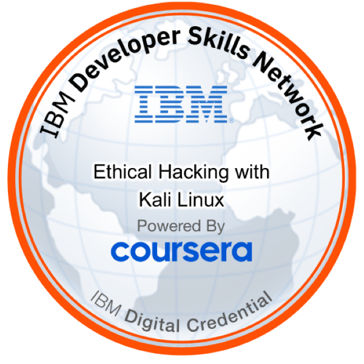
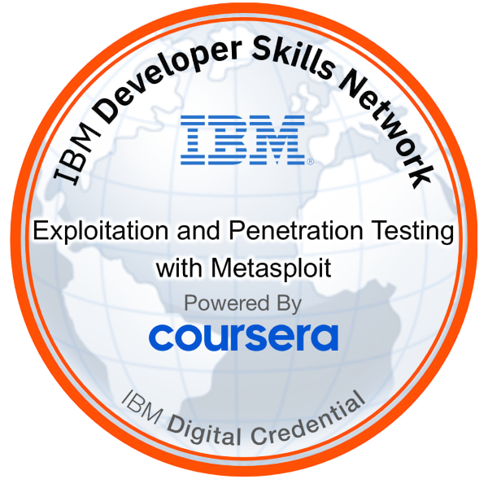
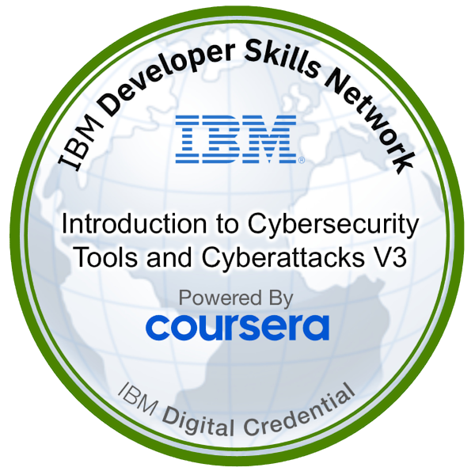
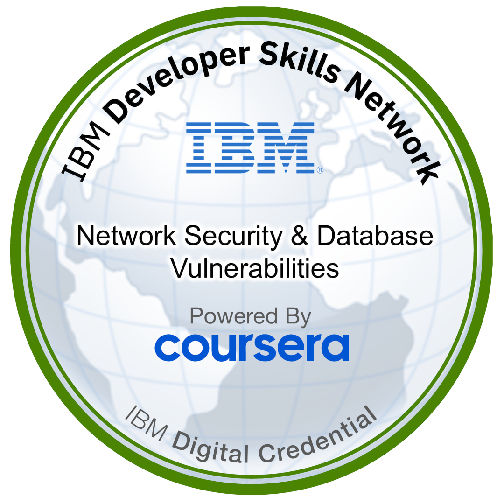
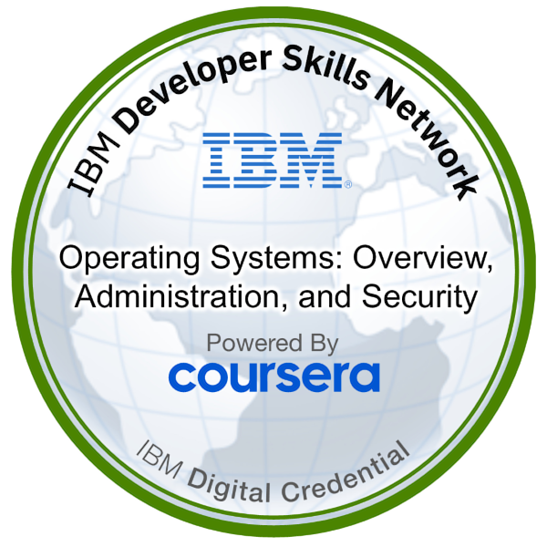

<!-- ========================================================= -->
<!--                    CYBER BANNER                           -->
<!-- ========================================================= -->

<div align="center">

# ⚡ ABDULLAH ZAHID ⚡

### `Cybersecurity • AI Engineer • Full Stack Developer • Embedded Systems`

<br/>


<br/>


</div>

---

# 🧠 SYSTEM PROFILE

<div align="center">

<table>
<tr>
<td width="50%">

## ⚡ PROFILE DATA
```yaml
Name: Abdullah Zahid
Alias: Coding with AZ

Role:
  - Cybersecurity Enthusiast
  - AI Developer
  - Full Stack Developer
  - Embedded Systems Builder

Education:
  - Northern University
  - Computer Science
  - 5th Semester

Current Focus:
  - Artificial Intelligence
  - Ethical Hacking
  - Smart Automation
  - Embedded Systems

Operating Systems:
  - Kali Linux
  - Windows 11

Status:
  - Building Real-World Projects
  - Learning Advanced Technologies
```

</td>

<td width="50%">

<div align="center">


<div align="center">

</div>


</div>

</td>
</tr>
</table>

</div>

# 🚀 FEATURED PROJECTS

<div align="center">

| 💡 Project | ⚙️ Description | 🛠️ Technologies |
|---|---|---|
| 🔐 AI Weapon Detection System | Real-time AI-powered weapon detection using computer vision and deep learning | Python • YOLOv8 • OpenCV |
| 🌱 Plant Disease Detection | Intelligent system for identifying plant diseases using AI models | Python • TensorFlow • Machine Learning |
| 🤖 Robotic Hand | App-controlled robotic hand with real-time movement control | Arduino • Python • C++ |
| 📡 Smart Attendance System | RFID-based attendance tracking automation system | RFID • Arduino • C++ |
| 🎤 Voice Recognition AI | AI-powered voice assistant and speech recognition system | Python • SpeechRecognition |

</div>

---

# 🏆 CERTIFICATIONS & BADGES

<div align="center">

<!-- Replace these with your Credly badge links -->

<a href="https://www.credly.com/badges/6d2993af-0654-454a-b670-eaae56166137/public_url">
  
</a>

<a href="https://www.credly.com/badges/e246df13-9cc1-422b-883c-0bf336a1e224/public_url">
  
</a>

<a href="https://www.credly.com/badges/6d3487f4-7ca5-4b85-8064-722788c54fc9/public_url">
  
</a>

<a href="=https://www.credly.com/badges/9a47dd03-ccdc-4368-9a2a-31eb21f94e28/public_url">
  
</a>

<a href="https://www.credly.com/badges/dc3ae491-b65a-4b68-be7e-2f76a2065df5/public_url">
  
</a>

</div>

---

# 👾 ARCADE CONTRIBUTION MATRIX

<div align="center">


</div>


# 🌐 CONNECT WITH ME

<div align="center">

<a href="https://www.linkedin.com/in/abdullah-zahid-000b39382/">

</a>

<a href="codingwithaz001@gmail.com">

</a>

<a href="YOUR_PORTFOLIO_LINK">

</a>

<a href="https://github.com/CodewithAz01">

</a>

</div>

---

# 💭 CYBER QUOTE

<div align="center">

### *"The quieter you become, the more you are able to hear."*

</div>

---

<div align="center">


</div>
